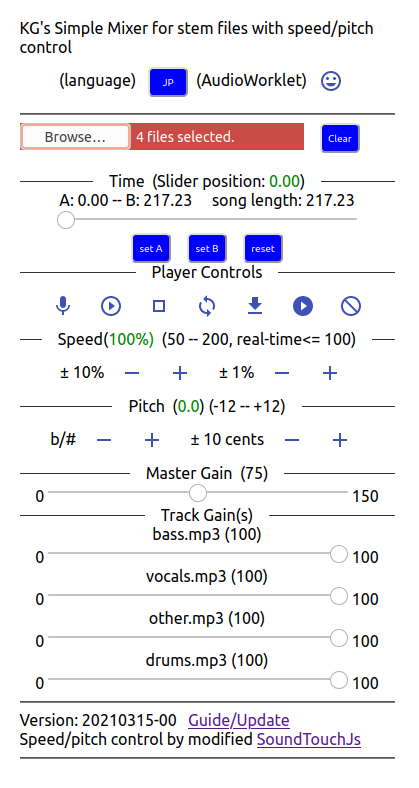

# simple-mixer (experimental since 2021-02-26)

This program mixes stem track files, plays, exports the
result to file;
typically separated with an audio source separation software such as Spleeter.

Using soundtouchjs, 
real-time playback speed is 0 < speed <= 1.0 (choppy playback if speed >1.0), 
but is not limited (speed > 0) for export (or playback after processing).

Written with React and Web Audio API.

## input audio files (wav, mp3, or whatever the browser supports)

Select multiple flles (5stem example)

`
bass.wav, drums.wav, other.wav, piano.wav, vocals.wav
`
## Demo
https://goto920.github.io/demos/simple-mixer/




## Addon to soundtouchJS 

```
npm install soundtouchjs
copy these two files in your project

MyPitchShifter.js
MyFilter.js (extends SimpleFilter)
```

They work as an intermediate ScriptProcessorNode either with AudioContext 
or OfflineAudioContext (NG for iOS).


### Examples
Currently stereo audio source only.
Arguments for MyPitchShifter() may change (see the source code).

#### For AudioContext (real-time playback)
```
import MyPitchShifter from './MyPitchShifter';

const context = new AudioContext();
const source = context.createBufferSource();
source.buffer = audioBuffer; // audioBuffer is the data to play 
// add silence(zeros) for slow playback 

const nInputFrames = audioBuffer.length*audioBuffer.sampleRate;
const bufsize = 4096; // 4096 or larger
const recording = false; // true to record the output
const bypass = false; // true to bypass the effect for test 
const shifter = new MyPitchShifter(
       context, nInputFrames, bufsize, recording, bypass);

shifter.tempo = 0.8; 
  // 80% speed (may be changed during playback). Choppy sound if tempo > 1.
const semiTonePitch = 1.0; // one semitone up (#)
shifter.pitch = Math.pow(2.0, semiTonePitch/12.0); 
  // may be changed during playback
const gainNode = context.createGain();
gainNode.gain.value = 0.7;

// shifter.node is the instance of ScriptNodeProcessor in MyPitchShifter
source.connect(shifter.node); 
shifter.node.connect(gainNode);
gainNode.connect(context.destination);
// Other nodes can be connected after shifter.node in case of AudioContext
source.start();

/* set callback functions */
// get the time in MyPitchShifter periodically
shifter.onUpdateInterval = 1.0; // in second
shifter.onUpdate = function() { 
  console.log('Playing At', shifter.playingAt);
}

// When there is no more output
shifter.onEnd = function() { 
  source.disconnect();
  if (recording) {
  // export the processed audio
  // shifter.exportToFile('mix_' + Date.now() + '.wav'); 
  // and /or play the processed audio //
  /*
     source2 = context.createBufferSource(); 
     source2.buffer = shifter.recordedBuffer;
     source2.connect(context.destination);
     source2.start();
  */
  }

}

// When source is stopped with GUI (stop button etc.)
source.onended = function(e) {
  shifter.stop(); // onEnded() will be called
}

```

#### For OfflineAudioContext (does not work on iOS devices)
Surprisingly this worked on macOS Safari and Chrome.

```
import MyPitchShifter from './MyPitchShifter';

let tempo = 1.5; 
const channels = 2;
const nInputFrames = audioBuffer.length*audioBuffer.sampleRate;
const nOutputFrames = Math.max(nInputFrames, nInputFrames/tempo);
context = new OfflineAudioContext (
    channels, nOutputFrames + 1.0*sampleRate, sampleRate);
// nOutputFrames is the expected length in frames (add 1 sec)
// Double the length of input audio for 50% playback

const bufsize = 4096; // 4096 or larger
const recording = true; 
const bypass = false; // true to bypass the effect for test 
const shifter = new MyPitchShifter(
       context, nInputFrames, bufsize, recording, bypass);
shifter.tempo = tempo; // Better not change during processing 
const semiTonePitch = -1.0; // one semitone down (b)
shifter.pitch = Math.pow(2.0, semiTonePitch/12.0); 
// Better not change during processing 

const source = context.createBufferSource();
source.buffer = audioBuffer; // audioBuffer is the data to play 
source.connect(shifter.node); 
shifter.node.connect(context.destination);
/* Note: shifter.node is the last node for OfflineAudioContext. 
   The output audio samples of ScriptProcessorNode 
   are collapsed (almost zero) in case of OfflineAudioContext
*/
source.start(); 

context.startRendering();

/* If you want to check how many seconds have been processed */
// shifter.onUpdateInterval = 10.0; 
// shifter.onUpdate = function() { console.log(shifter.playingAt); }

/* onEnd called when processing is over */
shifter.onEnd = function () {
  source.disconnect();
  shifter.exportToFile('mix_' + Date.now() + '.wav');
  /* And/or play shifter.recordedBuffer */
}

/* If you want interrupt the processing 
   Processing time is just a few seconds for five minutes song */
// source.onended = function (e) { 
//   shifter.stop(); 
// }


/* e.renderedBuffer 
  should be the processed samples but actually it is collapsed.
*/
// context.oncomplete = function(e) {
//  console.log( 'Offline render complete length = ', e.renderedBuffer.length);
// }

```

### Issues/Plan/Status
- Export mix to local file (as wav) ==> OK
- Adding pitch/speed control ==> OK
- Realtime playback -- slow down only (50 -- 100%) ==> OK
- Process offline and export with slow/fast playback (50 -- 200%) ==> OK
  - Export after real-time playback for iOS (with AudioContext)
  - Real-time playback is choppy if speed > 100%.
- Select file one by one (for iOS devices) ==> OK
- (Mar. 11) Voice recording with playback ==> Will think of this after other issues
- (Mar. 11) Worklet version ==> trying in branch worklet
  - Writing own worklet node and processor with the original soundtouchJS
  - works great with AudioContext real-time playback
  - Not tested with OfflineAudioContext yet.
- (Mar. 11) Player control bug (stop earlier than end when slow playback)
  - testing in branch worklet
  - Adding silence to the original source (double length for 50% playback)
- (Mar. 11) Performance issues ==> Reduce UI rendering 
  - testing in branch worklet
  - Component --> direct insertion in render return (ugly though)

